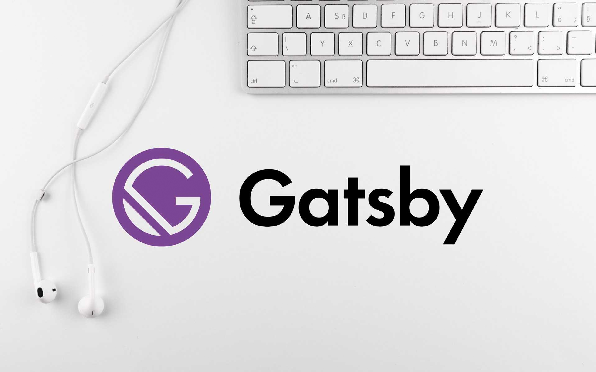

## TL;DR
Gatsby is a static site generator powered by React. You can get a website built with SEO, Google Analytics, and a progressive web app in a matter of minutes. All the prerequisites you need is a little comfort using the terminal and general knowledge of html and css.



## The Pitch
The power of modern web technology at your fingertips. It doesn't get any better. Instead of using a CMS or WYSIWYG and being dependent upon those services, you're learning a skill that will scale with you and your career. In the time it takes to read this first paragraph, you could've installed Gatsby with React and a few plugins. Another 5 minutes or so you could deploy to github and create a github pages url and have a hosted site for free.

The first time I picked up React - I failed miserably. I followed a lot of tutorials from some very great developers but the tutorials were out dated and the initilizations failed. Thats the problem with not being in the loop and understanding which dependencies are needed to successfully run you own local website for development. I did, however, have experience with static-site generators and I've used Jekyll for my previous portfolio but the platform didn't do what I wanted it to do because it basically used HTML and CSS. React does but it does it in such a better way. Think of the symbols in your sketch library and how you can reuse it over and over in your layouts and comps. React has that same principle called components. Its literally the greatest thing ever. 

Don't believe me? Check out this [tutorial video](https://www.youtube.com/watch?v=8t0vNu2fCCM&t=10173s) by Andrew Mead. He explains everything and teachs you how to build a Gatsby React site from scratch and deploy in a little over 4 hours.

## Lets Dive In
Only way to really understand what I'm talking about is to dive right in, lets do it!

Disclaimer: I'm on a Mac so I'm not sure what the steps are to recreate all of this in another OS.

Lets crack open terminal - if you've never coded on your machine before, we'll need to get a few things setup.
If you're unsure - we can do a quick check in the terminal. 

Start by typing the following...

```
npm -v
node -v
```

This will check if you have node installed on your machine. At the time of writing this post my latest versions are:

```
npm -v
6.14.4
node -v
v13.11.0
```

If you don't have node installed - there are several ways to get it up and running on your machine. The easiest way I found was to download a package called [HomeBrew](https://brew.sh/). 
Once you have that installed run the following command:

```
brew install node
```

Ok! We're almost there! We can finally install Gatsby and get started! We'll want to install it globally so please run this command:

```
npm install -g gatsby-cli
```

Alright! Phew! That was a lot of installing! We aren't done yet though. We now need to use a Gatsby command to install a project onto our machine. Before we do that, we'll want to navigate to the folder that we want to contain our project for me its located in _Documents/Projects/Code_ and to get there in our terminal we type:

```
cd documents/projects/code
```

Before we start the next step, I encourage you to checkout all the starters on the Gatsby site. Starters are a quick way to well - get started. The [official starters](https://www.gatsbyjs.org/docs/starters/#official-starters) include many options that already have SEO and other great things preinstalled. Whatever you choose the next step will be:

```
gatsby new [SITE_DIRECTORY_NAME] [URL_OF_STARTER_GITHUB_REPO]
```

What this does is it creates a new Gatsby project in the directory of your choosing with either a default starter ( if you didn't specify one ) or the one you choose.

For me, this is what the command looked like:

```
gatsby new gatsby-portfolio https://github.com/gatsbyjs/gatsby-starter-default
```

Once that is done installing, navigate to your project folder in the terminal. In this case it would be:

```
cd gatsby-portfolio
```

Lets get the server up and running with the following command:

```
gatsby develop
```

Now open up your browser of choice and type the following into the URL bar `localhost:8000` and there you have you have it! Its alive!

## Now What?

Now I'm going to take a break but I encourage you to look through the doucmentation on the Gatsby site and follow the tutorials there or from the video above. I'll post another tutorial in the coming days - nothing else to do since we're all locked in right?

### Stay Tuned and Thanks for Reading!