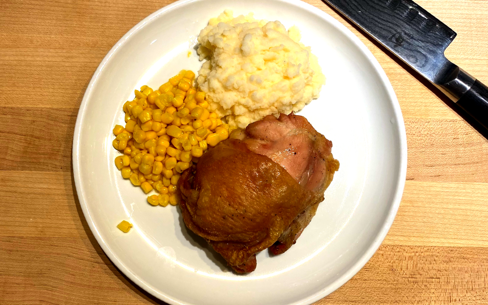
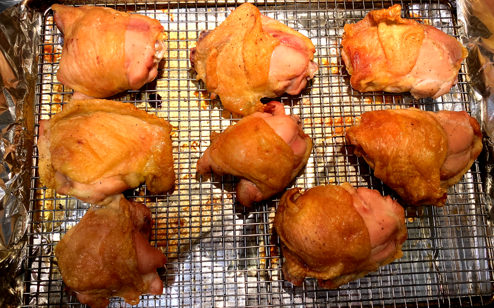

This is really a great and easy recipe. The prep time is minimal and its not like we don't have a lot of time on our hands right now.. right? The main problem is getting ingredients - so hopefully you have something similiar in your house.

## Prep Times

10 minute prep | 1 hour marinate | 45 - 50 minutes cook time

## What We'll Need

* 8 Chicken Thighs
* 2 TBSP Salt
* 2 TBSP Pepper
* 4 TBSP Olive Oil
* 1 TBSP Sugar

To start, preheat your oven to 400&#176;F.

While that is going, you'll want to pat dry your chicken and toss them into a bowl. Take the oil and coat the chicken. Now your dry ingredients, pre-mix them together in a seperate container and spread onto the chicken, try to evenly distribute it as much as possible. Leave the chicken in the bowl covered for an hour.

Get your sheet pan ready - line it with foil and place a wire rack on top if you have it. If not, no big deal.

Now go do something for an hour.

## Line'em up!

Place the chicken thighs - skin side up on the rack and spread them apart evenly. I generally do about a half inch apart if I can, just make sure they aren't touching. Its not that kind of a party. Get the chicken into the oven, hopefully in the hottest part of your oven, for me thats actually the top rack near the back.

### How did it turn out?! Hopefully well!
